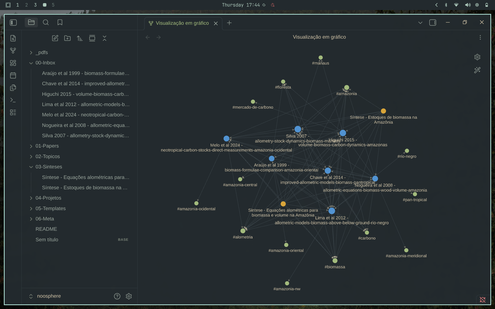

# Noosphere

> From a pile of forgotten PDFs to a navigable knowledge graph.

## What is Noosphere?

Noosphere is Vernadsky and Teilhard de Chardin's name for the sphere of human thought that emerges from the biosphere. This repo applies the same idea to personal research: a layer of structured thinking built on top of a collection of scientific papers — specifically, Amazonian forest science (biomass, allometry, carbon stocks).

The problem it solves is universal among researchers: you download a PDF, read it, annotate it, and then it sits in a folder forever. Six months later you vaguely remember someone found something important about carbon in the Rio Negro, but you cannot find it. You probably download the same paper twice.

Noosphere takes a different approach. Every paper becomes an atomic note with structured frontmatter, tags from a controlled vocabulary, and explicit links to other papers and topics. These notes live in an Obsidian vault that doubles as a graph database. The graph view shows what is actually connected in your head. The Dataview plugin turns the vault into a queryable database. AI skills (powered by Opencode) automate the grunt work of PDF extraction, tag auditing, and multi-paper synthesis.

The result is not a folder of PDFs. It is a second brain for your specific research domain.



## Repository Structure

```
_pdfs/          Original PDFs (gitignored)
00-Inbox/       Freshly extracted papers, unprocessed
01-Papers/      Processed and reference papers
02-Topicos/     Topic notes, one per research theme
03-Sinteses/    Cross-paper syntheses with comparison tables
04-Projetos/    Research project notes
05-Templates/   Templates for papers, topics, and syntheses
06-Meta/        Vault documentation, tag vocabulary, AI skills
    skills/     Opencode skills for paper extraction, audit, synthesis
```

The folder layout follows a Zettelkasten-inspired pipeline: capture lands in the Inbox, processing moves papers to Processed, linking connects them to Topics, and synthesis distills multiple papers into a Sintese.

## How It Works

### Philosophy

| Principle | Meaning |
|-----------|---------|
| Atomicity | One note = one concept. A paper is one atomic note. |
| Connections first | A note's value is in its edges. Every paper must link to at least one topic. |
| Incremental processing | Inbox -> Process -> Connect -> Synthesize. Done beats perfect. |

### Workflow

```
PDF found
  |
  v
Capture     extrair-paper skill extracts text and generates a formatted note (00-Inbox/)
  |
  v
Process     Read the paper, fill "My critique", adjust tags (status: concluido)
  |
  v
Connect     Link to topic notes, add [[wikilinks]] to related papers
  |
  v
Synthesize  Aggregate multiple papers into a cross-referenced synthesis (03-Sinteses/)
```

A weekly review audits tags, catches orphan notes, and enforces inbox zero.


## Infrastructure

| Tool | Role in this setup |
|------|--------------------|
| Obsidian | Markdown editor, graph view, backlinks, local-first storage |
| Dataview (plugin) | Turns frontmatter into a queryable database — list unread papers, filter by tag, query recent additions |
| Graph view | Visualizes the connection network between papers, topics, and syntheses |
| Templates (plugin) | Enforces consistent paper structure via the nota-paper template |
| Controlled tags | 4 categories: Status (inbox, concluido, referencia), Domain (alometria, carbono, floresta, ...), Region (amazonia, pan-tropical, ...), Output (achado-chave, para-citar) |
| Opencode | CLI AI assistant that runs vault skills: extrair-paper (PDF to note), revisar-tags (tag consistency audit), sintetizar-papers (multi-paper synthesis) |

There are no external databases, APIs, or services. Everything is flat Markdown files with YAML frontmatter. Obsidian is the browser; the filesystem is the database.

## Skills (AI-Powered)

Skills are markdown files inside `06-Meta/skills/` that serve as instructions for a large language model (LLM). When you run `opencode`, the skill is loaded into the model's context window. The LLM reads the PDF (or scans the vault) and executes the skill's steps step by step — extracting metadata, cross-referencing content, writing files. Opencode handles the tool calls (reading files, running commands, writing output); the skill tells the LLM what to do with those tools.

Three vault skills were created for this project:

| Skill | File | What it does |
|-------|------|-------------|
| extrair-paper | `06-Meta/skills/extrair-paper.md` | Reads a PDF, renames it to the vault convention, extracts frontmatter (authors, DOI, tags from the controlled vocabulary), fills the atomic note template, scans existing topic notes for connections, and saves the formatted note to `00-Inbox/` |
| revisar-tags | `06-Meta/skills/revisar-tags.md` | Scans all notes in the vault, extracts every tag in use, compares them against `06-Meta/tags.md`, and reports undocumented tags, obsolete tags, and duplicate synonyms. Also flags orphan notes (zero inbound or outbound links) |
| sintetizar-papers | `06-Meta/skills/sintetizar-papers.md` | Cross-references 2+ papers on a theme, validates every number against the original PDF (not just the note), generates a synthesis with comparison tables, per-paper analysis, conclusions, and open questions. Can also update an existing synthesis when a new paper is added |

The skills are modular and domain-agnostic. The `extrair-paper` skill references the vault's specific template sections and tag vocabulary, but the underlying pattern (read -> extract -> format -> connect -> save) works for any research field.

## Getting Started: Replicate This Environment

1. **Install Obsidian** from [obsidian.md](https://obsidian.md)
2. **Clone this repo** and open the directory as a vault (Obsidian -> Open folder as vault)
3. **Enable community plugins**: Settings -> Community plugins -> Browse -> install **Dataview** and **Templates**
4. **Place your PDFs** in `_pdfs/` (already in `.gitignore`)
5. **Capture a paper**: either run `opencode` with the `extrair-paper` skill, or create a note manually from the `nota-paper` template
6. **Follow the workflow**: process the paper (read, critique, tag), connect it to topics, and once you have 3+ papers on a theme, synthesize them with the `sintetizar-papers` skill

If you skip Opencode, the vault works as plain Obsidian. You lose the AI-assisted extraction but keep the graph view, Dataview queries, templates, and full workflow.

### Prerequisites

- Obsidian v1.5+ (for graph groups and Dataview compatibility)
- Dataview plugin v0.5+ (for dynamic frontmatter queries)
- (Optional) Opencode with API access to a capable LLM — the skills benefit from models with large context windows

## Adapting to Other Domains

The vault architecture is domain-agnostic. To repurpose it for a different research field:

| Component | What to change |
|-----------|---------------|
| Tag vocabulary | Replace `06-Meta/tags.md` with your own controlled terms |
| Paper template | Rewrite `05-Templates/nota-paper.md` section headings to match your field's paper conventions |
| AI skills | Edit `06-Meta/skills/extrair-paper.md` so the section names match your template |
| Topic notes | Create topic notes for your research themes |
| Workflow | The 4-step pipeline stays — only the content changes |

For fields with structured metadata (genbank IDs, chemical formulas, map coordinates, spectral indices), add extra frontmatter fields to the paper template and query them with Dataview. The graph configuration and Zettelkasten workflow transfer without modification.

## License

MIT. Use it, fork it, adapt it for your own research.
